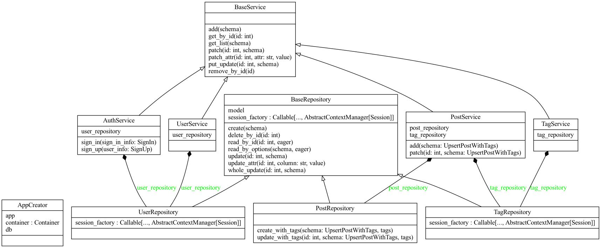

# API Sincrona

Para a atividade ponderada, foi escolhida a API em FastAPI, que é uma estrutura moderna (e relativamente nova) para criar APIs em Python com base em tipos de dados Python padrão e anotações de tipo. Ao qual possui a Clean Architecture como padrão de projeto. A API foi desenvolvida de forma síncrona, ou seja, a execução de uma tarefa é feita de forma sequencial, onde a próxima tarefa só é executada após a finalização da tarefa anterior.

A API foi desenvolvida com o intuito de ser simples e fácil de ser utilizada, com rotas para cadastro, listagem, atualização e remoção de usuários, além de rotas para cadastro, listagem, atualização e remoção de atividades. A API foi desenvolvida com base no padrão REST, onde cada rota é responsável por uma ação específica.

## Objetivo da API

A API faz o controle de usuário como cadastro e login, e o controle de atividades como cadastro, listagem, atualização e remoção tags s post para um blog. Como podemos ver na imagem abaixo:

### Diagrma de Classes



## Rotas

### Health Check
  - `GET /`: Rota para verificar se a API está funcionando corretamente.
### Usuários
  - `POST /user`: Rota para cadastrar um novo usuário.
  - `GET /user`: Rota para listar todos os usuários cadastrados.
  - `GET /user/{user_id}`: Rota para listar um usuário específico.
  - `PATCH /user/{user_id}`: Rota para atualizar um usuário específico.
  - `DELETE /user/{user_id}`: Rota para remover um usuário específico.
### Tags
  - `POST /tag`: Rota para cadastrar uma nova atividade.
  - `GET /tag`: Rota para listar todas as atividades cadastradas.
  - `GET /tag/{tag_id}`: Rota para listar uma atividade específica.
  - `PATCH /tag/{tag_id}`: Rota para atualizar uma atividade específica.
  - `DELETE /tag/{tag_id}`: Rota para remover uma atividade específica.
### Post
  - `POST /post`: Rota para cadastrar um novo post.
  - `GET /post`: Rota para listar todos os posts cadastrados.
  - `GET /post/{post_id}`: Rota para listar um post específico.
  - `PATCH /post/{post_id}`: Rota para atualizar um post específico.
  - `DELETE /post/{post_id}`: Rota para remover um post específico.

## Estrutura de Pastas da API

```bash	
.ponderda-1/
├── collection/
├── src/
│   ├── app/
│   │   ├── api/
│   │   ├── core/
│   │   ├── model/
│   │   ├── repository/
│   │   ├── schema/
│   │   ├── service/
│   │   ├── utils/
│   │   ├── __init__.py
│   │   └── main.py
│   ├── Dockerfile
│   └── alembic.ini
└── docker-compose.yml

```

## Como utilizar a API

### Localmente

1. Após clonar o repositório, acesse a pasta `ponderada-1`.
2. É necessário criar um arquivo `.env` na raiz da pasta `ponderada-1` com as seguintes variáveis de ambiente:

```env
    ENV=dev
DB_USER=postgres
DB_PASSWORD=postgres123
DB_HOST=db
DB_PORT=5432
```
3. Acesse a pasta `src` e instale as dependências do projeto com o comando: `pip install -r requirements.txt`
4. Acesse a pasta `app` e execute o comando: `uvicorn main:app --reload`	

### Docker

1. Após clonar o repositório, acesse a pasta `ponderada-1`.
2. No terminal, execute o comando: `docker-compose up --build`
3. Acesse o endereço `http://localhost:8000/docs` para visualizar a documentação da API.