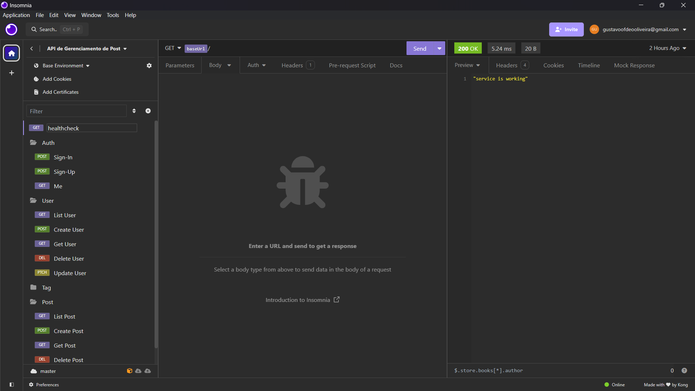
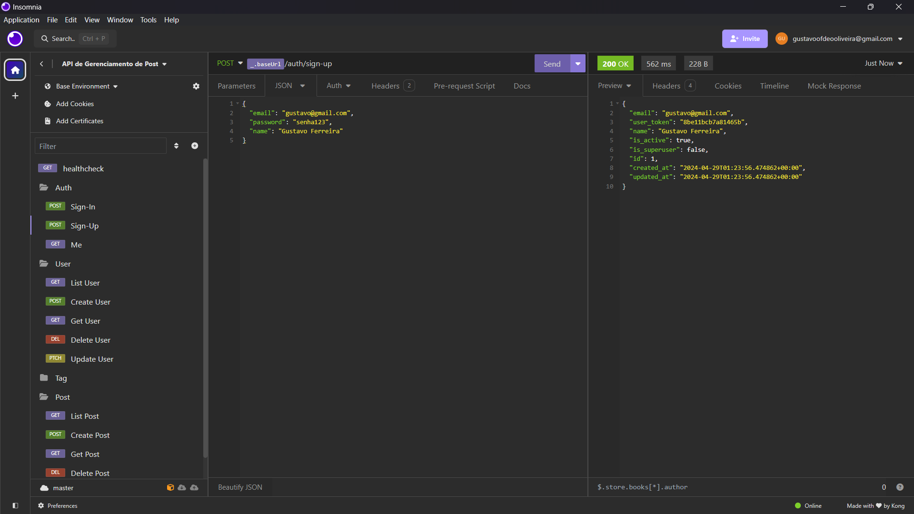
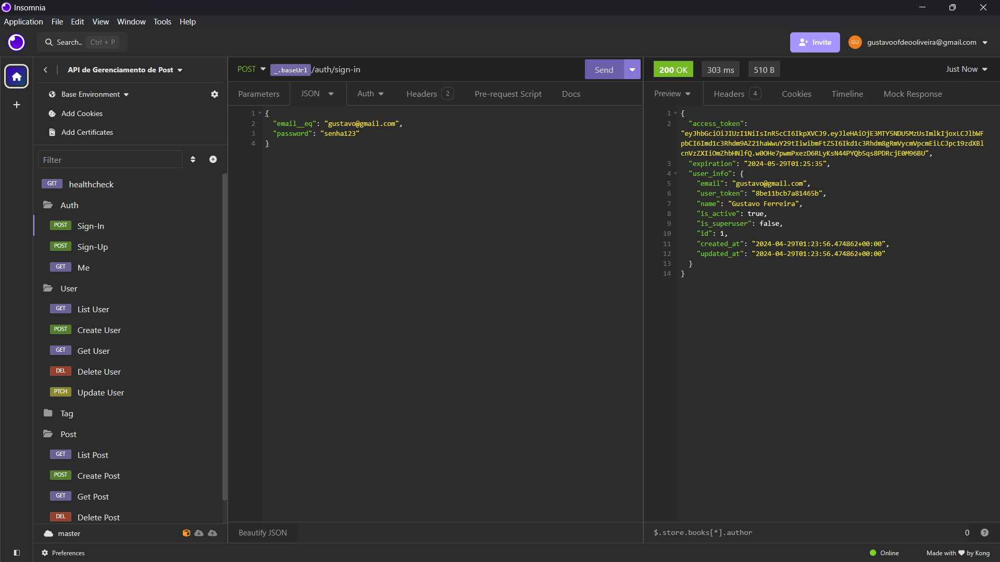
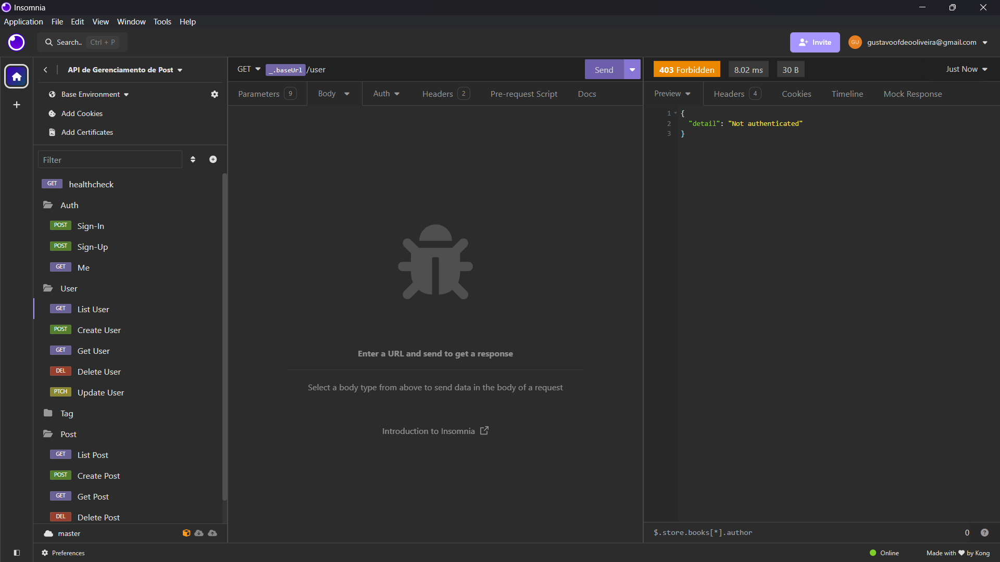

# Testes

Os testes são uma parte fundamental do desenvolvimento de software. Eles garantem que o código está funcionando corretamente e que as alterações feitas não quebraram funcionalidades existentes. Atualmente, o Pytest é utilizado para a realização dos testes no projeto.

## Teste de Integração

Os teste de integração são realizados para verificar se os componentes do sistema estão funcionando corretamente em conjunto. Eles são realizados para garantir que as partes do sistema estão se comunicando corretamente e que as funcionalidades estão sendo executadas conforme o esperado.

Atualmente, ps testes de integração são realizados utilizando o Pytest e o banco de dados PostgreSQL. Ao qual, checamos pela rota de `Health Check` se a API está funcionando corretamente e também se a rota de `Auth` está conseguindo realizar o cadastro e login de usuários.

### Exemplo de Teste de Integração

```python
def test_sign_up_and_sign_in(client):
    response = client.post(
        "/auth/sign-up",
        json={"email": "test", "password": "test", "name": "test"},
    )
    assert response.status_code == 200
    response_json = response.json()
    assert response_json["email"] == "test"
    assert response_json["name"] == "test"
    assert response_json["id"] > 0
    user_token = response_json["user_token"]

    response = client.post(
        "/auth/sign-in",
        json={"email__eq": "test", "password": "test"},
    )

    assert response.status_code == 200
    response_json = response.json()
    assert response_json["user_info"]["email"] == "test"
    assert response_json["user_info"]["name"] == "test"
    assert response_json["user_info"]["id"] > 0
    assert response_json["user_info"]["user_token"] == user_token
    assert response_json["access_token"] is not None

```

## Teste de Performance

Pela API executar de forma síncrona, tarefas que não desempenham tempo de execução significativo, como a leitura de um arquivo, podem ser realizadas de forma eficiente. Dessa forma, a API acaba tendo um bom desempenho para todas as tarefas que cada rota executa, como podemos ver nas imagens abaixo:

### Teste de Health Check

Nesta execução, a rota de `Health Check` foi executada em 8.02 ms.



### Teste de Sign Up

Nesta execução, a rota de `Sign Up` foi executada em 562 ms.



### Teste de Sign In

Nesta execução, a rota de `Sign In` foi executada em 303 ms.



## Teste de Segurança

Todas as rotas da API são protegidas por autenticação, ou seja, é necessário um token de acesso para acessar as rotas. Além disso, a API possui um sistema de autenticação baseado em JWT, onde o token de acesso é gerado a partir do email e senha do usuário. Dessa forma, a API garante que apenas usuários autenticados possam acessar as rotas protegidas.

### Exemplo de Teste de Segurança
No teste abaixo, é verificado se a rota de `User` está protegida por autenticação. Para isso, é feito um request para a rota sem passar o token de acesso. O teste espera que o status code retornado seja 401, indicando que o acesso foi negado.

```json
{
	"detail": "Not authenticated"
}
```


